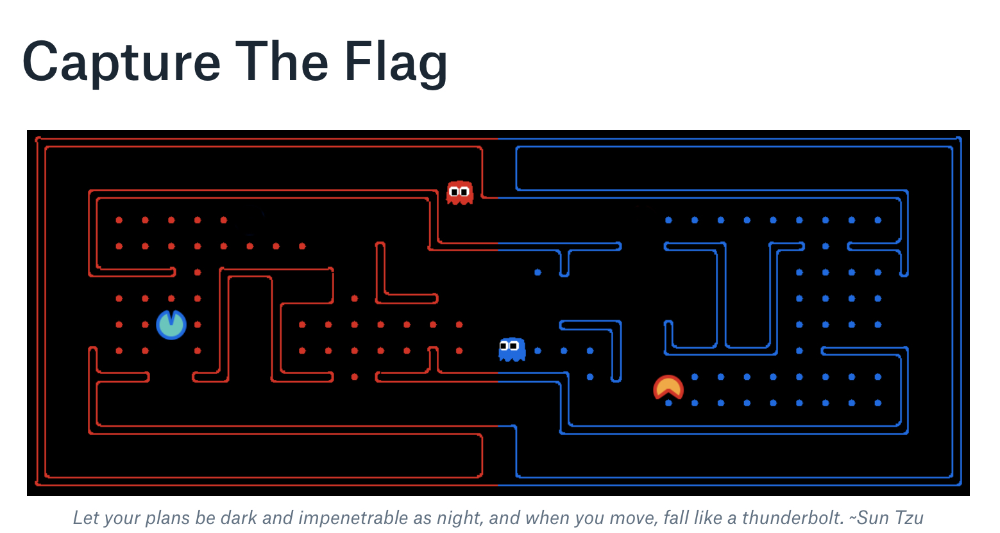
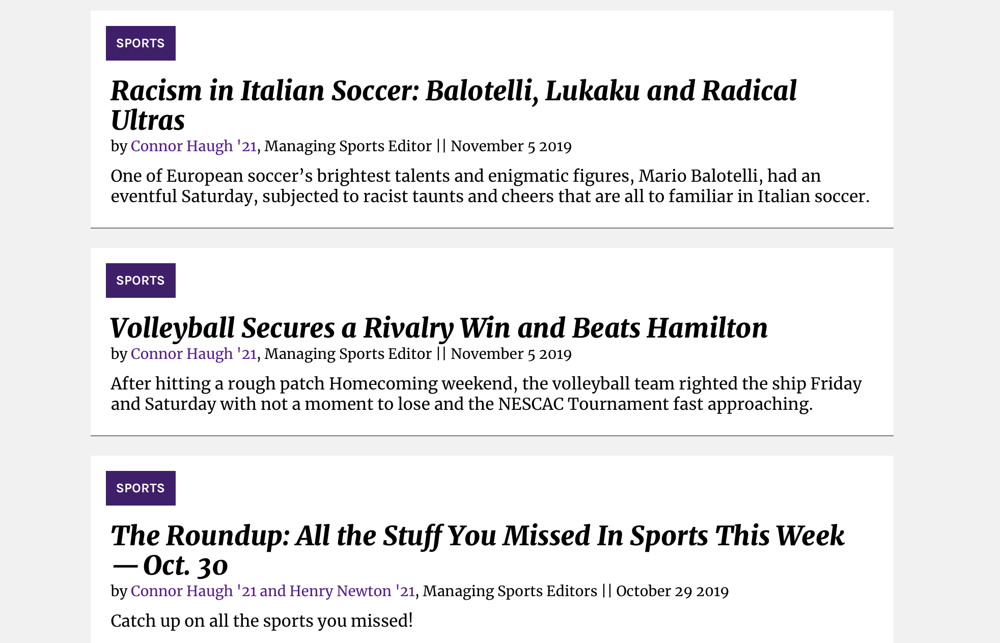

## Portfolio

---

### Category Name 1 

[Q-Learning Pacman CTF](https://github.com/connorhaugh/CTFTEAM)

---
[SAFERIDE](/sample_page)

---
[My Journalism](https://amherststudent.com/article/racism-in-italian-soccer-balotelli-lukaku-and-radical-ultras)

---
[Page Swapping]
This was a quick combo-project of my systems and AI coursework, based off the idea that a passive learning agent might learn a lot by watching a file system make LRU choices to a system (as there is a clear policy in place). The learner watches which pages are swapped out to the backing store, and generates feature weights based on the charectaristics of those pages. In turn, it can figure out which kinds of files are less likely to be referenced, and could perhaps create a policy which is more effective based on this learning. That might be my thesis....

---

---

Page template forked from <a href="https://github.com/evanca/quick-portfolio">evanca</a>

<!-- Remove above link if you don't want to attibute -->
